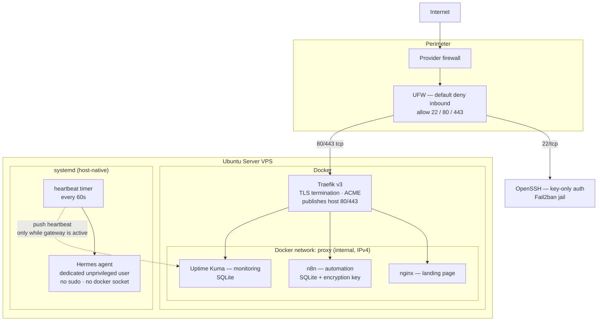
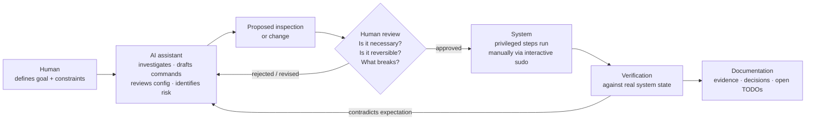

# Production-Style VPS Infrastructure — Engineering Case Study

**Live landing page: [https://pcvps.tech](https://pcvps.tech)**

A public, sanitized case study of a single-node Ubuntu Server VPS running a
containerized edge/application stack behind Traefik, plus a host-native AI
agent under systemd, with monitoring, alerting, and an in-progress
Disaster Recovery and encrypted backup design.

> **This repository contains the public landing page source, documentation,
> and sanitized examples.**
> The real environment is operated from a separate private repository.
> No private hostnames, IP addresses, credentials, tokens, push URLs, keys, database
> files, or production paths appear here. Every configuration file in
> `examples/` is an educational reconstruction using `${PLACEHOLDER}` values —
> not a copy of a deployed file.

---

## 1. Summary

| | |
| --- | --- |
| **Platform** | Single Hostinger VPS, Ubuntu Server 24.04 LTS |
| **Edge** | Traefik v3 — TLS termination, HTTP→HTTPS redirect, ACME certificates |
| **Workloads** | nginx landing page, n8n (automation), Uptime Kuma (monitoring) — all in Docker Compose |
| **Host-native service** | "Hermes" AI agent, dedicated unprivileged user, managed by systemd |
| **Public attack surface** | TCP 22, 80, 443 only. No application port is published on the host. |
| **Host controls** | UFW, Fail2ban, AppArmor, auditd, journald retention, unattended-upgrades, sysctl hardening |
| **Monitoring** | Uptime Kuma HTTP checks + a systemd-timer push heartbeat, alerting to a chat channel |
| **Backups / DR** | Design complete, implementation **in progress**. Restic + Backblaze B2 **planned**. Restore test **not yet performed**. |
| **Method** | AI-assisted engineering with human validation: `INSPECT → PLAN → CHANGE → VERIFY → DOCUMENT` |

### Public site source

The `site/` directory is the authoritative versioned source for the public VPS
landing page:

```text
site/
├── index.html
├── styles.css
├── script.js
└── translations.js
```

The Git repository is the authoritative source; the live VPS static web root is
a deployed runtime copy. The site uses static HTML, CSS, and vanilla JavaScript,
with no framework or build step. It supports English and Brazilian Portuguese,
browser-language detection, and a persisted manual EN/PT selection.

## 2. Why I built it

I wanted an environment where infrastructure decisions have real consequences:
real TLS certificates, a real public IP, real firewall rules, a real automation
platform holding real credentials, and a real monitoring system that pages me
when something breaks.

The goal was not "install services until the site loads". It was to practise the
part that actually matters in operations work:

- knowing what is exposed, and being able to prove it;
- knowing what is stateful, and knowing whether it can be restored;
- being able to rebuild the environment from documented, reproducible sources;
- treating "it works" and "it is verified" as different claims.

Most of the engineering effort in this project went into **auditing and
verification**, not installation. That bias is visible throughout this
repository.

## 3. Architecture overview



Key property: **the only host-published ports are 22, 80 and 443.** n8n and
Uptime Kuma publish nothing on the host — they are reachable exclusively through
Traefik over the internal `proxy` Docker network. The agent runs beside Docker,
not inside it, and declares no listener at all.

More detail, including the request path and the trust boundaries, is in
[`docs/architecture.md`](docs/architecture.md) and
[`diagrams/`](diagrams/README.md).

## 4. Technology stack

**Host:** Ubuntu Server 24.04 LTS · systemd · UFW · Fail2ban · AppArmor ·
auditd · journald · unattended-upgrades · sysctl hardening

**Containers:** Docker Engine · Docker Compose · Traefik v3 · nginx · n8n ·
Uptime Kuma

**Data:** SQLite (n8n, Uptime Kuma, agent state) · Docker named volumes

**Operations:** Git/GitHub (private ops repo) · systemd timers · Restic +
Backblaze B2 *(planned)* · Obsidian knowledge base for engineering notes

**Engineering method:** AI assistants (Claude Code / Codex) used under an
explicit human-approval workflow — see
[`docs/ai-assisted-engineering.md`](docs/ai-assisted-engineering.md).

## 5. Key engineering decisions

Each of these was a deliberate choice with a stated reason, not a default.

| Decision | Reason |
| --- | --- |
| Publish only 22/80/443 | Smallest defensible perimeter. Every other service is reachable only through the reverse proxy or not at all. |
| All web traffic through Traefik | One place that owns TLS, ACME, and routing. Adding a service means adding labels, not opening a port. |
| No host port mapping for n8n or Uptime Kuma | An application binding a host port silently bypasses both the perimeter model and the proxy. This is enforced as a repository invariant, not a habit. |
| Traefik dashboard not publicly exposed; `insecure: false` | An admin UI on the edge is an attack surface with no operational upside here. |
| Docker socket mounted **read-only** into Traefik | Traefik only needs to read container metadata. Read-only mounting limits, but does not eliminate, the blast radius — socket access is still privileged and is treated as such. |
| Admin user **not** added to the `docker` group | Docker group membership is effectively passwordless root. Docker administration goes through interactive `sudo docker …` instead, so every privileged action is an explicit act. |
| Agent runs as its own user: no sudo, no docker group, no docker socket, no copied SSH keys | An autonomous agent with root is not an agent, it is a liability. Its blast radius is bounded by Unix permissions, not by its own good behaviour. |
| `no-new-privileges:true` on edge containers | Cheap, standard privilege-escalation containment. |
| Pinned image tags, never `latest` | Reproducibility during recovery. (Resolving tags to immutable digests is still open — see below.) |
| Real failure tests over configuration-only validation | A monitor that has never fired is an untested monitor. |
| Backup is not "done" until a restore is tested | Stated as policy before any backup code was written, so the deadline could not quietly redefine the finish line. |

## 6. Security model

Layered, and each layer is validated independently rather than assumed:

- **Perimeter** — provider-level firewall plus UFW: default deny inbound,
  default deny forward, IPv6 handling explicitly enabled so IPv6 is not an
  unexamined blind spot.
- **Access** — SSH with public-key authentication only. Root login, password
  authentication, keyboard-interactive authentication, and empty passwords all
  disabled; reduced `MaxAuthTries` and `LoginGraceTime`; Fail2ban jail active.
- **Host** — AppArmor, auditd, journald with bounded retention,
  unattended-upgrades, and sysctl network/kernel hardening.
- **Privilege** — no passwordless sudo; admin user outside the `docker` group;
  the AI agent has neither sudo nor Docker access.
- **Application** — services isolated on an internal Docker network with no host
  port publication; secret-bearing files (`.env`, `auth.json`, agent config,
  the heartbeat script) held at restrictive modes and excluded from Git by
  policy and by `.gitignore`.

Two audit findings are worth calling out because they show the difference
between reading a config and knowing a system:

1. **SSH config said two different things.** The base `sshd_config` shipped with
   a late `PermitRootLogin yes`, while an `Include`d drop-in set
   `PermitRootLogin no`. OpenSSH takes the *first* obtained value, so the
   drop-in wins — but that is a claim about parsing order, not evidence. It was
   settled by reading the **effective** configuration:

   ```bash
   sudo sshd -t                          # syntax check before any reload
   sudo sshd -T | grep '^permitrootlogin '
   # → permitrootlogin no
   ```

   The lesson generalizes: on-disk configuration is a hypothesis; `sshd -T` is
   the evidence.

2. **`net.ipv4.ip_forward=1` looked wrong, and was not.** IP forwarding was
   enabled at runtime with no assignment anywhere in `/etc/sysctl.conf`,
   `/etc/sysctl.d/`, `/usr/lib/sysctl.d/`, or `/lib/sysctl.d/`. Correlating with
   the live Docker iptables chains and a `DROP` IPv4 `FORWARD` policy showed
   this to be runtime state owned by Docker bridge networking. It was recorded
   as an **inference**, not a fact, because no persistence file proves
   ownership — and the operational conclusion was to *not* "document" it with a
   duplicate persistent sysctl entry that Docker does not need.

Full detail: [`docs/security.md`](docs/security.md).

## 7. Monitoring and reliability

Two complementary signals:

- **HTTP checks** from Uptime Kuma against the public endpoints, alerting to a
  chat channel — deliberately a *separate* bot from the AI agent's bot, so a
  failure of the agent cannot silence alerting.
- **Push heartbeat** for the host-native agent: a systemd timer fires every
  60 seconds, a oneshot unit checks whether the gateway service is actually
  active, and pushes to Uptime Kuma **only** when it is. A missing push raises
  an incident. This monitors a process that exposes no HTTP endpoint of its own.

Verification work that shaped the design:

- **n8n readiness, not liveness.** `/healthz`, `/healthz/liveness`, and
  `/healthz/readiness` all return 200; the readiness path was chosen because it
  reflects usability rather than "the process exists".
- **A 302 that was not a bug.** An unprivileged audit fetched the Uptime Kuma
  root without following redirects and got `302 → /dashboard`, which appeared to
  contradict an earlier "final 200" record. Both were correct — they measured
  different points in one flow (`GET /` → 302 → `/dashboard` → 200). The real
  finding was a *dependency*: the monitor is only correct while it follows
  redirects. Accepting 200–299 without following would turn a healthy service
  into a permanent false alarm.
- **A real failure test.** The landing container was deliberately stopped,
  Uptime Kuma detected DOWN, the alert arrived, the container was restarted, and
  the recovery alert arrived. The full alert lifecycle is validated against a
  real workload rather than against a config file.
- **Traefik `/ping` deliberately not enabled**, because application endpoints
  already give a stronger signal and enabling it would add surface for no gain.

**Known blind spot, stated rather than hidden:** Uptime Kuma runs on the host it
watches, so it cannot alert on its own outage or on total host loss. Independent
external monitoring is an identified improvement, not an implemented control.

Full detail: [`docs/monitoring.md`](docs/monitoring.md).

## 8. Disaster Recovery — *in progress*

The DR model separates two things that are often conflated:

- **Reproducible configuration** — Compose files, Traefik config, systemd units,
  host hardening, runbooks. Lives in Git. Rebuildable, reviewable, diffable.
- **Irreproducible state and secrets** — SQLite databases, Docker volumes,
  encryption material, credentials. Never in Git; belongs to an encrypted backup
  process with separate custody.

Recovery therefore has two halves, and both must succeed. Documented recovery
work so far covers a clean-host bootstrap sequence, exact version pinning, and
preservation of a **local source patch** to the agent (recorded with its base
commit and a verified SHA-256) — because an environment that cannot reproduce
its own local modifications is not reproducible at all.

> **Status: the DR procedure is explicitly not validated.** It will only be
> considered complete after a real restore test on an isolated host, with
> recorded timings, evidence, and gaps. Anything short of that is a plan, not a
> recovery capability.

Full detail: [`docs/disaster-recovery.md`](docs/disaster-recovery.md).

## 9. Backup strategy — *design complete, implementation in progress*

Planned pipeline:

```text
live SQLite
  → application-consistent snapshot
    → staging directory (restrictive permissions, bounded lifetime)
      → Restic (encrypted, deduplicated)
        → Backblaze B2 (off-site)
```

Data is classified before it is backed up, because the categories have different
requirements:

| Category | Handling |
| --- | --- |
| Critical mutable data | Consistent capture, retention, integrity checks, tested restore |
| Secret-bearing recovery material | Encrypted backup with separate custody. Never in Git. |
| Reproducible configuration | Git |
| Operational documentation | Git |
| Disposable runtime data | Excluded |

**Why naïve file copies are unsafe here:** both application databases run SQLite
in **WAL mode**, and at inspection time each `-wal` file was *larger than its
main database* — for the automation platform, nearly three times larger. Copying
the `.db` alone during writes would not produce a slightly stale backup; it
would omit the majority of the live state. The inverse trap was also recorded:
some WAL files were 0 bytes at inspection, and a design that assumes that will
hold works right up until the first busy moment.

A second, sharper dependency: **the automation platform's stored credentials are
encrypted with a key held in a small config file inside the volume, not in an
environment variable.** A database restored without that file comes back with
every workflow intact and every credential undecryptable. Finding this before
building the backup, rather than during a recovery, is the single highest-value
result of the audit work.

> **Status: Restic + Backblaze B2 is planned and not yet implemented.** No
> restore has been tested. Current protection is provider-side snapshots only.

Full detail: [`docs/backup-strategy.md`](docs/backup-strategy.md).

## 10. AI-assisted engineering workflow

This project was built with heavy AI assistance and deliberate human control.
Both halves are true, and stating only one of them would be dishonest.



**AI did:** investigation, command drafting, configuration review,
documentation, risk identification, architecture discussion, troubleshooting.

**The human did:** approve every privileged command, execute sudo interactively,
validate actual system state, check results, decide whether to apply changes,
test behaviour, and maintain least privilege.

The operating rule: **model output is a hypothesis or an engineering aid, never
ground truth.** Several claims in this project's history were produced
confidently by an assistant and then corrected by the system itself — the SSH
`PermitRootLogin` contradiction and the `ip_forward` ownership question are both
examples. The workflow exists so that the system, not the model, gets the last
word.

Full detail: [`docs/ai-assisted-engineering.md`](docs/ai-assisted-engineering.md).

## 11. Real validation performed

Concrete things that were tested against the running system, not merely
configured:

- Effective SSH policy read with `sshd -T` after a syntax check with `sshd -t`,
  resolving a genuine contradiction between the base config and a drop-in.
- Host services confirmed enabled and active: UFW, Fail2ban, AppArmor, auditd,
  unattended-upgrades, journald retention settings.
- Runtime sysctl state observed directly (reverse-path filtering, syncookies,
  ICMP redirect handling, kernel pointer/dmesg restrictions, hardlink/symlink
  protection).
- Unexplained loopback listeners investigated to completion and classified
  **expected / benign / localhost-only** — rather than being left as ambient
  suspicion or dismissed without evidence.
- IPv6 exposure audited **separately** from IPv4: Docker networks confirmed
  IPv6-disabled, the shared proxy network confirmed IPv4-only.
- `ip_forward` traced to Docker bridge networking and recorded as an inference,
  with the reasoning and its limits both written down.
- Application health endpoints probed and compared before a monitor path was
  chosen.
- Redirect semantics of the monitoring UI reconciled across two audits that
  appeared to disagree.
- A deliberate container stop → alert → restart → recovery-alert cycle,
  validating the whole alerting chain end to end.
- Heartbeat chain verified live: timer enabled and waiting, last invocation
  exiting `0/SUCCESS`, next firing scheduled, script present at restrictive
  ownership and mode — with its contents deliberately left unread because it is
  secret-bearing.
- A privileged read-only inventory pass that closed gaps an earlier
  **unprivileged** audit had explicitly flagged as unverifiable, instead of
  filling them with assumptions.

## 12. Lessons learned

Condensed; the full set is in [`docs/lessons-learned.md`](docs/lessons-learned.md).

1. **Configuration on disk is a hypothesis. Effective state is the evidence.**
2. **An audit run without privilege must report what it *could not* see.** The
   unprivileged pass was denied Docker, the stack directory, and the named
   volumes; naming those gaps was what made the later privileged pass useful.
3. **Two sources disagreeing usually means they measured different things.**
   The 302-vs-200 case was reconciliation, not correction.
4. **Anomalies deserve investigation, not reflex.** Unknown listeners and
   enabled IP forwarding both looked alarming and were both benign — but only
   *checking* could establish that.
5. **Backups are about restores.** Copying a WAL-mode SQLite file is not a
   backup, and a credential database without its encryption key is not a
   recovery.
6. **Least privilege applies to AI agents too**, and it is cheap to enforce at
   the Unix layer before it is ever needed.
7. **Write down the finish line before you approach it.** "Not complete until a
   real restore test" was recorded early, which is why it is still labelled
   *in progress* here instead of quietly rounded up to *done*.

## 13. Current status

| Area | Status |
| --- | --- |
| Edge routing, TLS, HTTP→HTTPS redirect | Operational |
| Application stacks behind the proxy | Operational |
| Host hardening baseline | Operational, audited |
| Agent under systemd with bounded privileges | Operational |
| Monitoring + alerting, validated by a real failure test | Operational |
| Path-level backup inventory | Complete for the current plan |
| SQLite consistency mechanism | **In progress** — must be chosen and tested per application |
| Restic + Backblaze B2 implementation | **Planned** |
| Restore test | **Not performed** |
| DR runbook | **Skeleton** — promoted to runbook only after a successful restore test |
| Independent external monitoring | **Planned** |
| Image tags resolved to immutable digests | **Open** |

## 14. Repository structure

```text
vps-public-portfolio/
├── README.md
├── LICENSE
├── .gitignore
├── docs/
│   ├── architecture.md            System model, request path, trust boundaries
│   ├── security.md                Layered controls and how each was verified
│   ├── monitoring.md              Signals, alerting, validation, blind spots
│   ├── disaster-recovery.md       Recovery model and its validation gate
│   ├── backup-strategy.md         Data classification and the SQLite problem
│   ├── ai-assisted-engineering.md How AI was used, and how it was bounded
│   └── lessons-learned.md         What the project actually taught
├── diagrams/
│   └── README.md                  Mermaid diagrams (architecture, flows)
├── examples/
│   ├── docker/                    Sanitized Compose + Traefik static config
│   ├── systemd/                   Sanitized unit, drop-in, and timer examples
│   ├── host/                      Sanitized SSH, UFW, sysctl, journald examples
│   └── scripts/                   Sanitized heartbeat + pre-commit secret scan
├── site/                          Authoritative public landing page source
└── assets/
```

## 15. Relevance

The work in this repository maps to **AI Automation Engineer**,
**Automation Engineer**, **Platform / Infrastructure Engineer**,
**DevOps-adjacent**, and **Solutions Engineer** roles: containerized service
delivery behind a reverse proxy, host hardening and privilege design, monitoring
and alerting validated by real failure, backup and DR reasoning grounded in
storage-engine behaviour, and a documented, auditable method for working with AI
assistants in privileged environments.

---

### On honesty in this repository

Where something is unfinished, it says so. Where a conclusion is an inference
rather than a measurement, it says that too. The parts still labelled
*in progress* — SQLite consistency, Restic/B2, and above all the restore test —
are the parts that will make this system genuinely recoverable, and they are not
claimed before they are true.
