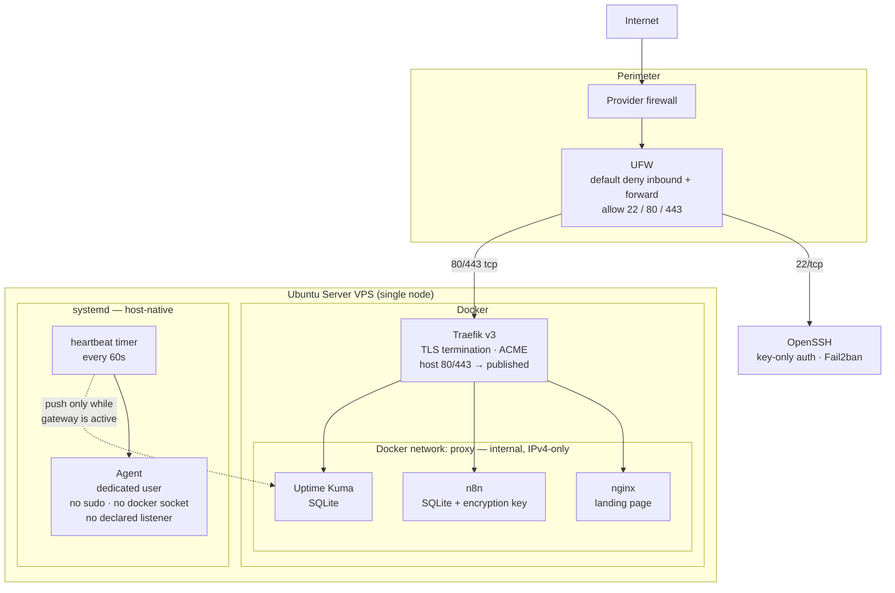
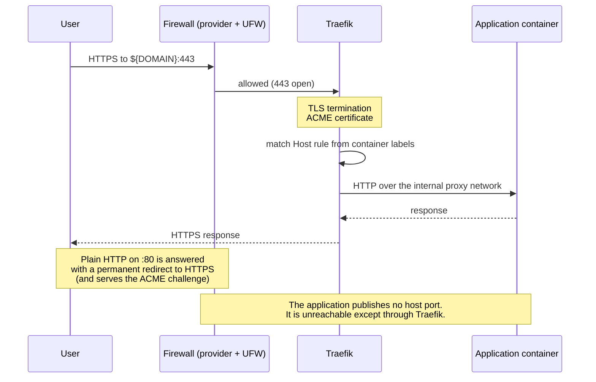
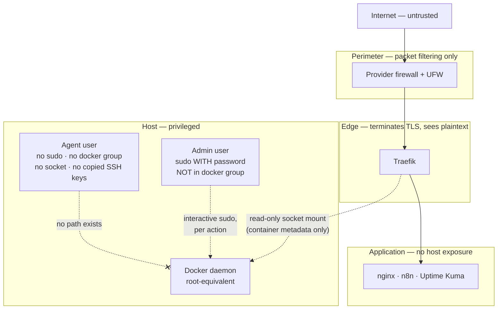
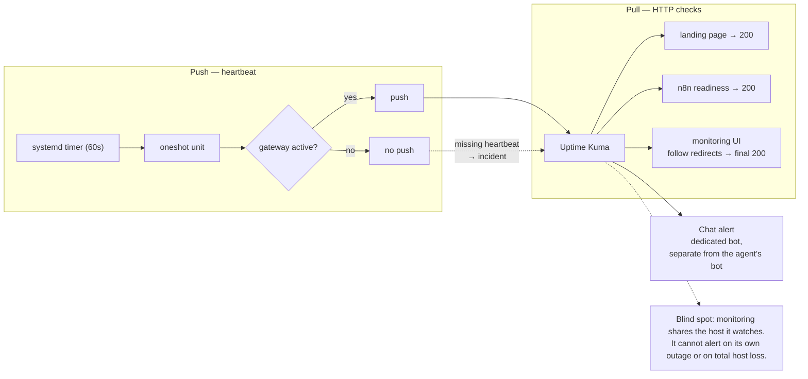
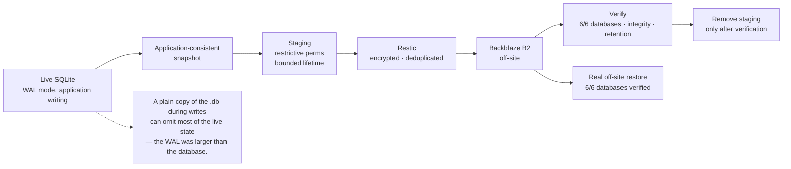
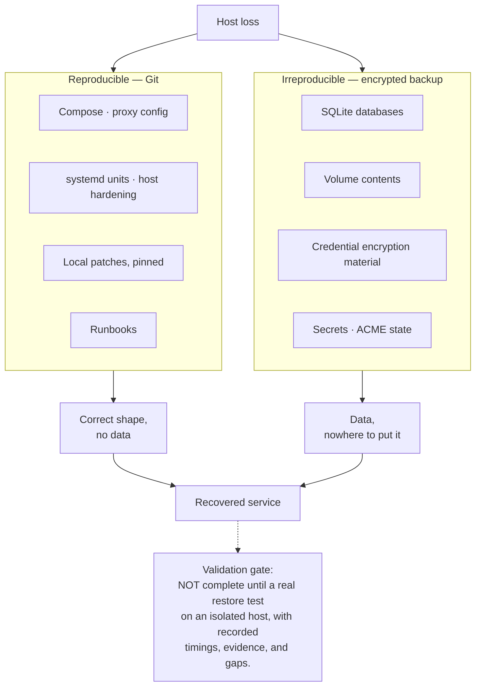
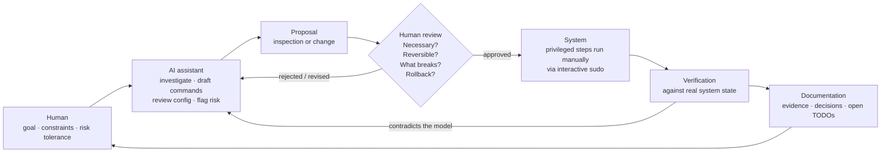
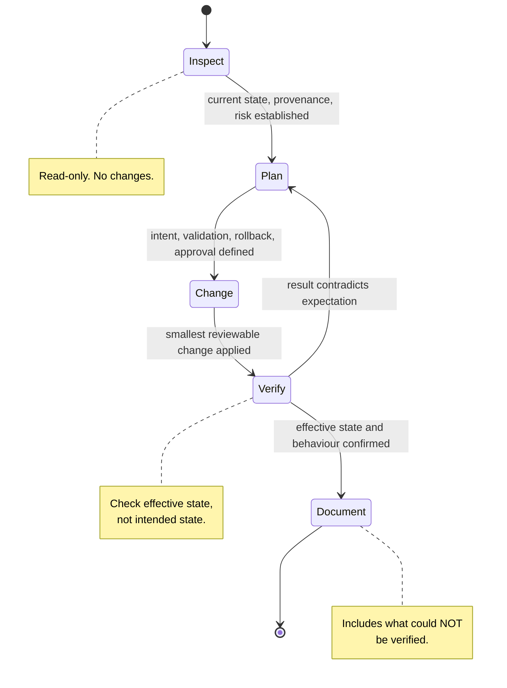

# Diagrams

Mermaid source, rendered inline by GitHub. Sanitized: no hostnames, addresses,
or production paths.

---

## 1. System architecture

## 2. Request path

## 3. Trust boundaries and privilege

## 4. Monitoring signals

## 5. Backup pipeline — *operational and restore-validated*

## 6. Disaster Recovery — two halves

## 7. AI-assisted engineering loop

## 8. Change lifecycle

