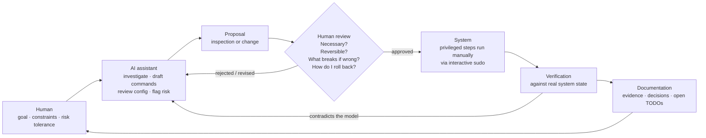

# AI-Assisted Engineering

How AI assistants were actually used in this project, where the boundaries were,
and why the boundaries exist.

This document is deliberately specific. "AI-assisted" is doing a lot of work as
a phrase right now, and it can mean anything from "I asked a chatbot a question"
to "an agent has root on my production host". Neither describes this project.

---

## 1. The claim

**AI-assisted engineering with human validation.**

Not "AI built my infrastructure". Not "AI wrote some docs". Assistants did a
large share of the investigation, drafting, and writing. A human approved every
privileged action, ran every sudo command interactively, and checked every
result against the real system.

Both halves are load-bearing. Dropping the first would understate the leverage;
dropping the second would misrepresent the control model.

## 2. Operating loop

Formally: **INSPECT → PLAN → CHANGE → VERIFY → DOCUMENT.**

| Phase | What happens |
| --- | --- |
| **Inspect** | Establish current state, provenance, dependencies, and risk. Read-only. No changes, no exceptions. |
| **Plan** | State the intended result, how it will be validated, how it will be rolled back, and what approval it needs. |
| **Change** | The smallest reviewable change. One at a time. |
| **Verify** | Check effective state, not intended state. Test behaviour, not configuration. |
| **Document** | Record what was verified, what was decided, what remains open — including what could *not* be verified. |

The loop is not decoration. Two of this project's more useful findings — the SSH
`PermitRootLogin` contradiction and the `ip_forward` ownership question — were
produced by the **Verify** step contradicting a confident earlier claim.

## 3. Division of labour

### What AI assistants did

- **Investigation** — proposing what to look at, and in what order, when
  auditing an unfamiliar part of the system.
- **Command drafting** — writing the inspection and configuration commands,
  including the flags that are easy to get subtly wrong.
- **Configuration review** — reading Compose files, unit files, and hardening
  configs and pointing at what looked inconsistent.
- **Documentation** — the majority of the written architecture, security, and
  operational documentation, including this repository.
- **Risk identification** — naming failure modes and blast radius before a
  change, and flagging when a proposal was larger than the problem.
- **Architecture discussion** — arguing through trade-offs (host-native versus
  containerized agent; readiness versus liveness probes; where the backup
  boundary sits).
- **Troubleshooting** — hypothesis generation when something did not behave as
  expected.

### What the human did

- **Approved every privileged command** before it ran — individually, not as a
  blanket grant.
- **Executed sudo interactively.** No passwordless sudo exists on the host. No
  assistant ever held a credential.
- **Validated actual system state.** Every claim that mattered was checked
  against the running system.
- **Decided whether to apply changes** — including rejecting proposals that were
  technically fine but unnecessary.
- **Tested behaviour** — the deliberate container-stop alerting test being the
  clearest example.
- **Maintained least privilege**, deliberately and repeatedly, against the
  constant pull of convenience.

## 4. Privilege boundaries, concretely

These are enforced by the operating system, not by prompt instructions:

- No passwordless sudo on the host, for any user.
- The admin user is **not** in the `docker` group — so no assistant operating as
  that user can obtain root through Docker.
- The host-native agent runs as a dedicated user with **no sudo, no docker group
  membership, and no Docker socket access**.
- The administrator's SSH private keys are not present in the agent's account.
- The agent has no publicly exposed port.
- Assistants operate in a workspace-scoped mode by default; stepping outside it
  requires explicit authorization and still runs with the ordinary user's
  permissions — authorization is not elevation.
- No assistant configures a Git remote, pushes, or changes the live host without
  a specific approval for that specific action.

The design rule: **an assistant's blast radius should be bounded by Unix
permissions, not by its own good behaviour.** Model behaviour is a probability
distribution; file permissions are not.

## 5. Model output is a hypothesis

The single most important working assumption:

> Model output is an engineering aid or a hypothesis. It is never ground truth.

This is not scepticism for its own sake — it is the only assumption consistent
with the observed record. Examples from this project:

**The SSH contradiction.** A base config with a late `PermitRootLogin yes`, a
drop-in with `PermitRootLogin no`. Reasoning about OpenSSH's first-value-wins
semantics gives the right answer, and reasoning is still not evidence.
`sudo sshd -T` settled it. Had the reasoning been wrong, the difference between
"we discussed it" and "we checked it" would have been remote root login.

**`ip_forward=1`.** A plausible explanation was available immediately. The
correct output was not the explanation but its epistemic status: recorded as an
**inference** drawn from correlation with Docker's iptables chains, with the
absence of a persistence file noted as the reason it cannot be called proven.
The operational conclusion followed from the uncertainty — leave it alone,
and do not add a config entry asserting ownership nobody has established.

**The 302.** Two sources appearing to disagree about a status code. The instinct
is to declare one wrong. The correct move was to notice they measured different
points in one redirect flow — and then to extract the actual finding, which was
a hidden dependency in the monitor's configuration.

**Unknown loopback listeners.** Neither "probably fine" nor "possible
compromise". Identify the owning processes, classify with evidence, write it
down.

The pattern: the assistant's contribution is speed and coverage. The human's
contribution is deciding what counts as proof.

## 6. Practices worth keeping

- **Read-only first, always.** Inspection has no rollback requirement.
- **Never reload a daemon whose syntax you have not validated** — especially the
  one providing your only access path.
- **Keep a second session open** during access-affecting changes.
- **One change at a time**, so that verification is attributable.
- **Record confidence levels.** "Confirmed", "inferred", "documented only", and
  "to verify" are different claims and should not be written identically.
- **Report what you could not see.** An unprivileged audit that names what it
  was denied is far more useful than one that quietly stops at the boundary.
- **Never let an assistant read a secret-bearing file to "check" it.** The
  heartbeat script's contents were deliberately left unread; metadata was enough
  to verify what needed verifying.
- **Documentation is part of the change**, not a follow-up task. A change is not
  finished until its verification and operational impact are written down.

## 7. Honest limitations

- The workflow is **slower** than letting an agent act autonomously. That is the
  intended trade: this host has real TLS certificates, real credentials, and a
  real recovery cost.
- It depends on the human actually reading proposals rather than approving them
  reflexively. Approval fatigue is a real failure mode, and the mitigation is
  keeping change batches small enough to genuinely review.
- Documentation generated by an assistant can be **confidently wrong**. The
  countermeasure used here is that documentation claims are tied to observed
  evidence, and unverified items are explicitly labelled rather than smoothed
  over.
- None of this makes the system secure. It makes the *process* auditable. The
  security comes from the controls in [`security.md`](security.md), which were
  themselves verified rather than assumed.
