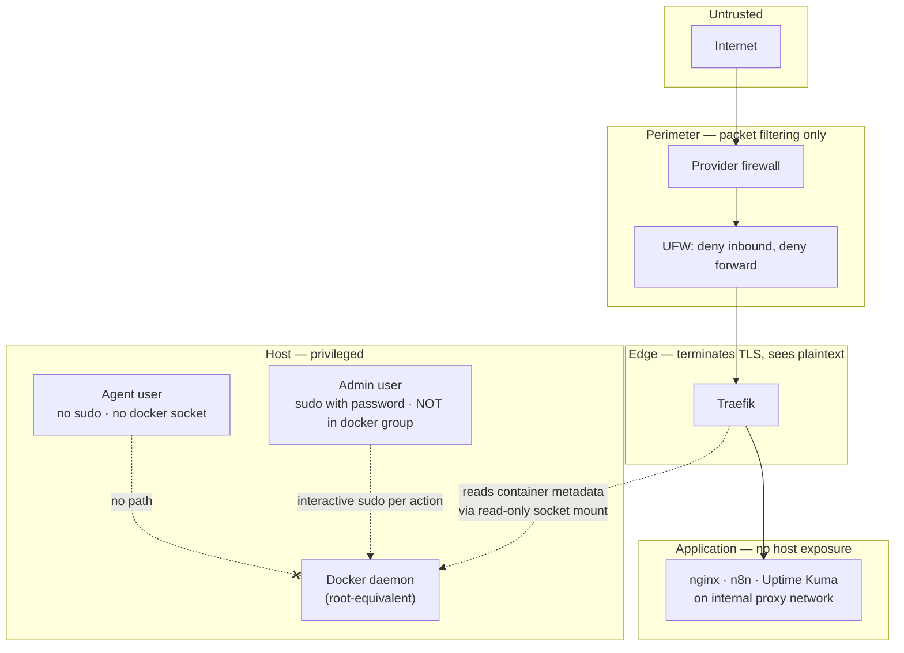

# Architecture

Sanitized description of a single-node VPS running a containerized web stack
behind a reverse proxy, plus a host-native agent under systemd.

> Hostnames, IP addresses, and production paths are replaced with placeholders.
> Nothing here is a copy of a deployed file.

---

## 1. Host

| Property | Value |
| --- | --- |
| Provider | Commodity VPS provider (single node) |
| Operating system | Ubuntu Server 24.04 LTS |
| Hostname | `${HOSTNAME}` |
| Primary domain | `${DOMAIN}` |
| Service management | Docker Compose (applications) + systemd (host-native services) |

There is no orchestrator, no second node, and no load balancer. That is a
deliberate scope choice: the interesting problems here are exposure, privilege,
state, and recoverability — all of which exist in full at one node, and none of
which are solved by adding more.

## 2. Request path

```text
Internet
  └── provider firewall
      └── UFW (default deny inbound)
          ├── TCP 22  → OpenSSH (key-only, Fail2ban jail)
          └── TCP 80/443 → Traefik
                └── Docker network `proxy` (internal, IPv4-only)
                    ├── nginx landing page
                    ├── n8n
                    └── Uptime Kuma
```

Traefik is the only container that publishes host ports. The application stacks
declare **no** host port mappings; they attach only to the shared `proxy`
network and are addressed by Traefik through container labels.

Port 80 exists solely to redirect to 443 and to serve the ACME HTTP challenge.

## 3. Trust boundaries



Three boundaries matter most:

1. **Perimeter → edge.** Only three ports cross it. Everything else is dropped
   by default, in both address families.
2. **Edge → application.** Applications are unreachable except through Traefik.
   An application that publishes a host port would silently punch through both
   the perimeter model and the proxy — so "no host port publication" is treated
   as an invariant, not a convention.
3. **Anything → Docker daemon.** Docker socket access is root-equivalent. The
   admin user is deliberately *not* in the `docker` group; the agent has no path
   to the socket at all; Traefik gets a read-only mount and nothing more.

## 4. Components

| Component | Runtime | Exposure | State |
| --- | --- | --- | --- |
| Traefik v3 | Docker Compose | Host TCP 80/443 | ACME store (secret-bearing, excluded from Git) |
| Landing page (nginx) | Docker Compose | Via Traefik | Static content, bind-mounted read-only |
| n8n | Docker Compose | Via Traefik | Named volume: SQLite DB + config holding the credential encryption key |
| Uptime Kuma | Docker Compose | Via Traefik | Named volume: SQLite DB |
| Agent ("Hermes") | Host / systemd | No listener declared | SQLite state, sessions, secret-bearing config |

Image tags are pinned to specific versions rather than `latest`, so a recovery
reproduces the version that was actually running. Resolving those tags to
immutable digests is still open — a tag is a pointer, and pointers move.

## 5. The host-native agent

The agent runs directly on the host under systemd rather than in a container,
because it needs host context for the operational tasks it performs. That choice
raises the privilege question immediately, and it is answered at the Unix layer:

- dedicated system user and group, created for this purpose only;
- no sudo access, and no `NOPASSWD` entries;
- not a member of the `docker` group; no Docker socket access;
- the administrator's SSH private keys are not present in the agent account;
- restrictive umask applied through a systemd drop-in;
- `Restart=always` with a backoff, plus explicit exit-status handling so a
  deliberate stop is distinguishable from a crash loop;
- a planned-stop marker written on controlled shutdown, so monitoring can tell
  an intentional stop from an outage.

The unit declares no network listener. Its liveness is therefore observed by a
push heartbeat rather than by an HTTP probe — see
[`monitoring.md`](monitoring.md).

## 6. Networking notes

- The shared `proxy` network is **external** to every Compose project: the
  stacks join it, none of them creates it. This keeps stack lifecycles
  independent of the network's lifecycle.
- The proxy network is IPv4-only, and all Docker networks were confirmed to have
  IPv6 disabled. IPv6 was audited separately from IPv4 rather than assumed to
  follow it.
- `net.ipv4.ip_forward=1` is live on the host with no assignment in any sysctl
  file. Correlated with the live Docker iptables chains and a `DROP` IPv4
  `FORWARD` policy, this is runtime state owned by Docker bridge networking.
  Recorded as an **inference**, not a proven fact — and the operational
  conclusion was to leave it alone rather than add a redundant persistent entry
  "documenting" behaviour Docker manages itself.
- `/etc/default/ufw` policy variables are **not** the effective ruleset. Reading
  the defaults file proves the default policy and nothing about which allow
  rules exist or how Docker-managed filtering interacts with them. Effective
  rules must be read from the live firewall.

## 7. Reproducibility boundary

```text
Git (private ops repo)          Encrypted backup (planned)
──────────────────────          ──────────────────────────
Compose files                   SQLite databases
Traefik static config           Docker volume contents
systemd units and drop-ins      Credential encryption material
Host hardening config           Secret-bearing config and env files
Local source patches            ACME account/certificate state
Runbooks and documentation      Agent session/state data
```

Neither half alone restores the service. Git makes the system *rebuildable*;
the backup makes it *the same system*. Conflating the two is the most common way
a "backed up" environment turns out not to be.

## 8. Open items

- Resolve pinned image tags to immutable digests.
- Record Docker Engine and Compose version constraints for recovery.
- Capture a sanitized **effective** firewall ruleset, not just default policy.
- Document service owners, dependencies, health checks, and recovery priority.
- Define and validate how placeholder values are injected at deploy time.
