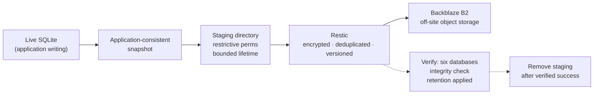

# Backup Strategy

> **Status: operational and restore-validated.**
> Encrypted Restic backups to Backblaze B2 run automatically and passed a real
> off-site data restore. A full replacement-VPS rebuild and measured recovery
> time remain pending.

---

## 1. Design

Each arrow exists for a reason:

- **live → snapshot** — because copying a live database is not backing it up
  (§3).
- **snapshot → staging** — so the encryption/upload step reads a file nobody is
  writing to, with a bounded window and restrictive permissions.
- **staging → Restic** — encryption happens *before* the data leaves the host,
  so the storage provider never holds plaintext.
- **Restic → B2** — off-site, because a backup on the same host does not survive
  the failure it exists for.
- **verify → cleanup** — staging is removed only after verification, never
  before.

## 2. Data classification

Backups are designed by category, not by directory listing, because the
categories have genuinely different requirements.

### Critical mutable data

Application state that cannot be recreated from source configuration: the
SQLite databases and volume contents for the automation platform, the
monitoring platform, and the host-native agent.

Requirements: consistent capture, defined retention, integrity checks, and a
**tested** restore.

### Secret-bearing recovery material

Credentials and keys required to restore service — including the material that
decrypts other backed-up data. Backed up through a separately controlled,
encrypted process. **Never in Git**, sanitized or otherwise.

Includes agent configuration and auth files, environment files, the ACME store,
and the monitoring heartbeat script (whose embedded push URL is itself a
credential).

The repository password and object-storage credentials are held both in
restricted on-host files and in separate off-host custody. Their values and
custody mechanism remain outside this public repository. A backup whose only
key lives inside the backup would not be a recovery plan.

### Reproducible configuration

Compose files, proxy config, systemd units, host hardening. Belongs in Git, with
secret values as placeholders. Does not belong in the backup — duplicating it
there creates two sources of truth that will drift.

### Operational documentation

Architecture records, decisions, inventories, runbooks. Git, and evolving with
the system rather than written once.

### Disposable / runtime data

Logs, caches, temporary files, dependency directories, container layers.
Excluded by default. Diagnostic-retention exceptions must be argued for
individually, not assumed.

## 3. Why naïve SQLite copies are unsafe

This is the technical core of the design, and it is not hypothetical here.

SQLite in **write-ahead logging (WAL)** mode does not write committed
transactions straight into the main `.db` file. Commits land in a `-wal` file
and are folded back into the database at checkpoints; a `-shm` file holds the
shared index that makes the WAL readable. Consequently:

- a copy of only `.db` taken during writes can be **stale by the entire contents
  of the WAL**;
- a copy of `.db`, `-wal`, and `-shm` taken non-atomically can be **internally
  inconsistent** — three files from three different instants;
- either can be **unusable** rather than merely old.

Inspection of the running system made the scale concrete:

| Database | `-wal` size relative to main DB |
| --- | --- |
| Automation platform | WAL **≈ 3× larger** than the database |
| Monitoring platform | WAL **larger** than the database |
| Agent state stores | WAL **0 bytes at the moment of inspection** |

The first two mean a naïve `.db` copy would not lose a little recent state — it
would omit **most** of the live state.

The third row is the more dangerous one. Observing an empty WAL **once** proves
nothing about the next run. A backup design that quietly relies on "the WAL is
usually empty" works perfectly until the first busy moment, which is exactly the
moment worth backing up. The recorded rule is explicit: **do not assume WAL
files are always empty.**

The implemented pipeline uses SQLite's online-backup API through
`sqlite3 SOURCE_DB ".backup 'TARGET_DB'"`. It captures six databases while the
applications continue running, excludes the live WAL/SHM sidecars from the
archive, and runs `PRAGMA integrity_check` against every staged snapshot. All
six checks passed before archive and again after the real restore.

## 4. The encryption-key dependency

The single highest-value finding of the audit work:

> The automation platform's stored credentials are encrypted with a key held in
> a small config file inside its data volume — **not** in an environment
> variable, and not anywhere in the Compose configuration.

Consequences:

- a backup containing the database but not that file restores every workflow
  intact and **every stored credential undecryptable**;
- the failure is silent at restore time. The service starts, the workflows are
  there, and the breakage only surfaces when a workflow tries to authenticate;
- the file is small enough to be overlooked by any inventory built from file
  sizes or "important-looking" names.

This was found during a **pre-implementation inventory**, not during a recovery.
That timing is the whole argument for auditing state before designing a backup:
the same discovery made during an outage is an unrecoverable outage.

Handling constraint: the key must never be printed, logged, or echoed — during
backup, restore, or a restore test. The real restore verified that the config
file containing it returned with the database, without displaying its value.
Application-level credential use remains an acceptance criterion for the future
full-host rebuild drill.

## 5. Inventory

A privileged, read-only inventory pass produced a path-level list of everything
that must survive host loss, with each path classified by recovery value. It is
marked **complete for the current plan** — not complete in the absolute sense.

Its remaining recorded limits:

- which sysctl drop-ins are operator-authored versus OS defaults is not fully
  separated;
- whether one stray proxy config backup file is needed is undetermined;
- the role of provider-side snapshots in the recovery policy remains
  undecided.

The landing page now has an authoritative off-host source in this repository's
`site/` directory, so deployed HTML is reproducible configuration rather than
backup-managed state. Off-host custody of the backup credentials is also
confirmed.

The inventory has a **re-run trigger**: any new stack, volume change, or custom
systemd unit invalidates it. An inventory without a trigger becomes fiction on
the first change nobody thought to record.

Notably, this pass closed gaps that an earlier **unprivileged** audit had
explicitly flagged as unverifiable — it had been denied access to Docker, the
stack directory, and the named volumes, and said so. Naming the gaps rather than
guessing at them is what made the later pass targeted.

## 6. Implemented automation

The running pipeline uses a root-only ephemeral staging directory and removes
it after every run. A systemd oneshot service and persistent timer run the
backup daily at approximately 03:30 local time. Backup and maintenance share a
lock so they cannot overlap.

Retention keeps 7 daily, 4 weekly, and 6 monthly snapshots. Weekly maintenance
runs pruning plus a full repository integrity check. The final recorded
repository check completed without errors.

## 7. Validation and remaining work

| Item | Status |
| --- | --- |
| SQLite consistency mechanism, six databases | **Validated** |
| Restic repository and private B2 storage | **Operational** |
| Daily scheduling and non-overlapping maintenance | **Operational** |
| Retention: 7 daily / 4 weekly / 6 monthly | **Operational** |
| Integrity checks before archive and after restore | **Validated** |
| Off-host custody of repository password and B2 credentials | **Confirmed** |
| Real off-site data restore | **Validated** |
| External backup-failure alerting | **Planned** |
| Full-VPS rebuild and measured RTO | **Not performed** |
| Provider snapshot role | **Undecided** |

The completed restore recovered all six SQLite databases and the critical
recovery files, including the automation platform's encryption-key file. This
proves the data-recovery path; it does not prove a provision-to-operational
replacement-host rebuild.

## 8. Non-negotiables

- Never expose repository or storage credentials in Git, command output, logs,
  or documentation.
- Never overwrite live data without a verified rollback copy and explicit
  approval.
- Never infer SQLite consistency from a successful file copy — a copy that
  completes without error tells you nothing about whether the result opens.
- **A backup system is not complete until a restore has been tested.** That bar
  is met for the off-site data set; full-system Disaster Recovery remains a
  separate, open test.
