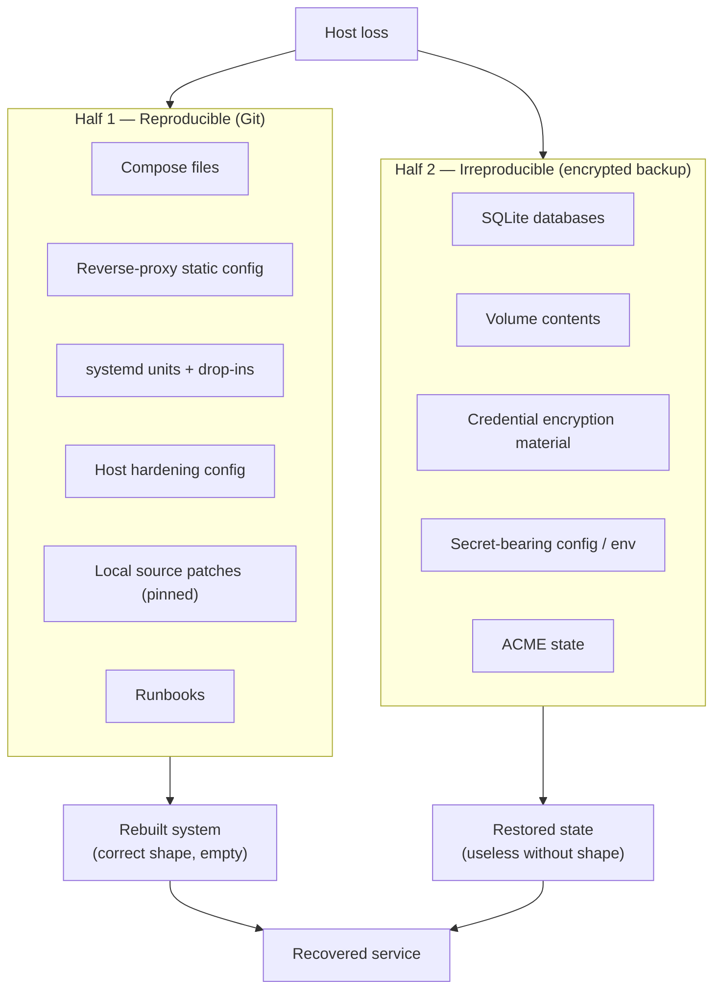

# Disaster Recovery

> **Status: skeleton. Not validated.**
> This document describes a recovery *model* and an ordered outline. It is
> deliberately not presented as a finished runbook, because it has never been
> executed against a real failure or a real restore test.

---

## 1. The validation gate

> **The Disaster Recovery procedure will only be considered validated after a
> real restore test on an isolated host, with recorded timings, evidence, and
> gaps.**

This sentence was written into the project *before* the backup system was
designed, specifically so that schedule pressure could not later redefine what
"done" means. Every claim below is therefore labelled as design, outline, or
verified fact — never as a guarantee.

An untested recovery procedure has an unknown success probability. Writing it
down improves the odds; it does not establish them.

## 2. Recovery model

Recovery has two halves, and both must succeed:

Git makes the system **rebuildable**. The backup makes it **the same system**.
An environment with only the first comes back with no data; an environment with
only the second has data and nowhere to put it. Treating "we have a Git repo" as
a recovery plan is the most common version of this mistake.

## 3. Configuration reproducibility

Everything needed to reconstruct the *shape* of the system is version
controlled, sanitized, and reviewed:

- Compose files for every stack, with pinned image tags;
- reverse-proxy static configuration;
- systemd units, drop-ins, and timers;
- host hardening: SSH drop-in, firewall defaults, sysctl, journald;
- operator runbooks.

Values that cannot be committed appear as named placeholders (`${DOMAIN}`,
`${ACME_EMAIL}`, `${WEBHOOK_URL}`, …). A deployment-time rendering mechanism is
required, and **validating that mechanism is an open item** — placeholders that
nobody has tested substituting are a recovery hazard of their own.

## 4. Version and commit pinning

Recovery must reproduce the versions that were actually running, not the latest
available:

- container images pinned to explicit version tags, never `latest`;
- the host-native agent pinned to a specific upstream commit;
- Docker Engine and Compose version constraints recorded (**open item**);
- resolving image tags to immutable digests (**open item**) — a tag is a
  mutable pointer, and "pinned" is only true until the publisher moves it.

## 5. Preserving local patches

The host-native agent runs with a **local source modification** that changes a
network-fallback behaviour in one of its platform adapters. This is the kind of
detail that is invisible during normal operation and fatal during recovery: a
rebuild from the upstream commit alone produces subtly different runtime
behaviour, and the difference is only discovered under the exact conditions the
patch exists to handle.

The handling:

- the patch is stored as a reviewed diff in the private ops repository;
- its base upstream commit is recorded;
- its SHA-256 is recorded and was verified byte-for-byte against the reviewed
  source file at import time.

**What that verification does and does not establish**, stated precisely because
the distinction matters:

| Established | Not established |
| --- | --- |
| The stored patch file is intact and matches the reviewed export | That the recorded base commit is authentic |
| Two independent copies produced the same digest | That the patch applies cleanly to that commit |
| | That the resulting runtime behaviour is correct |

The last two can only be established in a restore environment. They are listed
as recovery-test acceptance criteria rather than assumed.

General principle: **an environment that cannot reproduce its own local
modifications is not reproducible.** Undocumented local patches are one of the
most common reasons a "fully version-controlled" system does not come back the
same.

## 6. Separating Git-managed config from backup-managed state

| Belongs in Git | Belongs in encrypted backup | Belongs in neither |
| --- | --- | --- |
| Compose, proxy config, systemd units | SQLite databases and sidecars | Logs |
| Host hardening config | Docker volume contents | Caches, temp files |
| Local patches, runbooks, docs | Credential encryption material | Container layers |
| Placeholder templates | Secret-bearing config/env/auth files | Dependency directories |
| | ACME account and certificate state | |

The rule that keeps this honest: **if losing it means data loss, it is not
configuration.** If regenerating it is deterministic from committed sources, it
does not belong in the backup.

## 7. Secrets restoration

Secrets are restored through a **separately controlled** path, not from Git and
not casually:

- retrieved through an approved secure process;
- written with correct ownership and restrictive permissions, then temporary
  copies removed;
- never echoed into shell history, logs, or documentation;
- rotated when incident conditions warrant it — a recovery following a
  compromise should not restore the credentials that were compromised.

An unresolved custody question is recorded explicitly: **a backup whose only
decryption key lives inside the backup is not a recovery plan.** Where the
repository password and object-storage credentials will be held off-host is an
open decision, not an implementation detail.

## 8. Recovery outline

Ordered, with each phase's acceptance criteria still to be established by the
restore test.

1. **Provision** a clean Ubuntu host of the same major version; validate
   resources, time synchronization, and console access.
2. **Users and access** — administrative user, group membership, sudo policy.
   Restore access without ever copying private SSH keys into a repository.
3. **SSH** — apply the hardening drop-in; **prove a second authenticated session
   works before closing the bootstrap path.**
4. **Firewall** — default deny, allow the three public ports, validate IPv4 and
   IPv6 separately, preserve a rollback path that cannot lock out SSH.
5. **Host controls** — Fail2ban, AppArmor, auditd, journald, unattended-upgrades,
   sysctl.
6. **Docker** — approved Engine and Compose versions; recreate the shared
   external network before any stack.
7. **Reverse proxy** — deploy config, restore secret material through the secure
   channel, validate routing and certificate issuance or restoration.
8. **Application stacks** — in a defined order. **Restore consistent mutable
   data before activating the service**, so the application does not write into
   a half-restored state. Confirm no application publishes a host port.
9. **Host-native agent** — install pinned source, apply the reviewed patch,
   install units, restore the heartbeat endpoint outside Git.
10. **Restore from backup** — authenticate without exposing credentials, select
    and verify the snapshot, restore into **staging first**, never directly over
    live paths.
11. **DNS** — validate records, propagation, and cutover; define rollback
    criteria.
12. **Verification** — systemd and container health, external routes,
    application behaviour, data integrity, persistence across a controlled
    restart.
13. **Monitoring** — confirm checks and heartbeat reporting resume, confirm alert
    delivery without disclosing destination credentials, then observe for an
    agreed stabilization period before declaring recovery complete.

## 9. What the restore test must produce

Not a pass/fail. A record:

- date, environment, operators;
- actual recovery time per phase, and total;
- actual recovery point achieved — how much data was lost;
- every step that did not work as written, and the correction;
- every assumption that turned out to be wrong;
- follow-up owners for each gap.

Only after that record exists does this document get promoted from *skeleton*
to *runbook*.

## 10. Current honest position

| Item | Status |
| --- | --- |
| Reproducible configuration in Git | Done |
| Local patch preserved, digest verified | Done |
| Patch applies cleanly to base commit | **Unverified** |
| Path-level inventory of what must survive | Complete for the current plan |
| SQLite consistency mechanism | **In progress** |
| Encrypted off-site backup (Restic + B2) | **Planned** |
| Off-host custody of backup credentials | **Undecided** |
| Restore test | **Not performed** |
| DR runbook | **Skeleton** |

Present protection against total host loss is provider-side snapshots. That is
a fallback, not a designed recovery capability, and it has not been tested
either.
