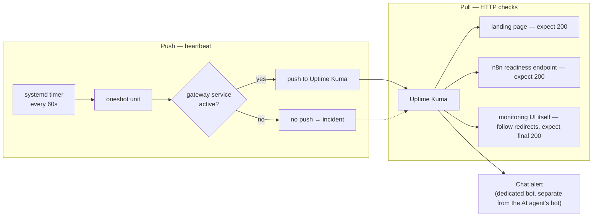

# Monitoring and Reliability

Two signals, one alert channel, and a set of verification results that changed
the design.

---

## 1. Signal model



**Pull** covers anything that answers HTTP. **Push** covers the host-native
agent, which declares no listener and therefore cannot be probed.

## 2. Why the alerting bot is separate from the agent's bot

The AI agent uses a chat integration. Monitoring uses a *different* bot on the
same platform. If they shared an identity, an agent failure or a revoked token
could take down alerting at exactly the moment alerting matters. Separating them
costs one extra bot registration and removes a shared failure mode.

## 3. The push heartbeat

```text
systemd timer (OnBootSec=1min, OnUnitActiveSec=1min, AccuracySec=5s, Persistent=true)
  → oneshot service
    → heartbeat script (root-owned, mode 0750)
      → check: is the gateway service active?
        → if yes: push to the monitoring endpoint
        → if no:  push nothing
          → missing heartbeat raises an incident
            → chat alert
```

The design decision worth noting: the script pushes **only when the service is
genuinely active**. A heartbeat that fires unconditionally from a timer proves
that the timer works, not that the service works — it is a monitor of itself.
Gating the push on `systemctl is-active` makes the absence of a signal
meaningful.

`Persistent=true` means a missed window during downtime is caught up on boot
rather than silently skipped.

The script is **secret-bearing**: the push URL is a credential. It is held at
restrictive ownership and mode, excluded from Git, and its contents were
deliberately left unread during audits. Only a placeholder template is
published:
[`../examples/scripts/uptime-push.example.sh`](../examples/scripts/uptime-push.example.sh)

Verified live: timer enabled and `active (waiting)`, a recorded trigger time, a
subsequent invocation exiting `0/SUCCESS`, the next firing about a minute out,
and the oneshot correctly reporting `inactive (dead)` between runs — which is
the expected state for a `Type=oneshot` unit, not a fault.

**Still open on the push path:** the monitoring-side half — the push monitor's
configured interval and retry behaviour — has not been traced end to end. A
heartbeat that arrives is only useful if the receiving monitor's timing window
matches the sending cadence.

## 4. Verification results that changed the design

### Readiness beats liveness

Three health endpoints on the automation platform all returned 200:

```text
/healthz
/healthz/liveness
/healthz/readiness
```

The readiness path was chosen because it reflects whether the application is
*usable*, not merely whether the process is running. A liveness probe passes
during states where the service cannot actually serve work — which is precisely
the outage a user experiences and a liveness monitor misses.

### The 302 that was not a bug

An unprivileged audit fetched the monitoring UI root **without following
redirects** and observed:

```text
GET /            → 302  Location: /dashboard
```

This appeared to contradict an earlier record expecting a final `200`. Both
records were correct — they measured different points in one flow:

```text
GET /        (-L)  → /dashboard → 200
GET /dashboard     → 200
```

No correction was needed. What *was* needed was making the hidden dependency
explicit: **this monitor is only correct while it follows redirects.**
Configuring it to accept 200–299 without following would turn a perfectly
healthy service into a permanent false alarm — and a monitor that cries wolf is
worse than no monitor, because it trains the operator to ignore it.

This is also a small lesson in reading disagreements between sources: two
observations that conflict usually differ in *method*, not in fact.

### Traefik `/ping` deliberately not enabled

Enabling the proxy's built-in ping endpoint was considered and rejected:
application endpoints already provide a stronger signal (they exercise routing,
TLS, and the application), while `/ping` would add an endpoint that reports the
proxy is alive even when everything behind it is broken. Not enabling it also
avoids adding surface for no operational gain.

## 5. Real failure test

Configuration-only validation was explicitly rejected as insufficient. The full
alert lifecycle was exercised against a real workload:

1. Stop the landing container deliberately.
2. Uptime Kuma detects DOWN.
3. Chat alert received.
4. Start the container again.
5. Uptime Kuma detects recovery.
6. Recovery notification received.

This validates the entire chain — check → detection → notification → delivery →
recovery — rather than the belief that each link is configured correctly. A
monitor that has never fired is an untested monitor.

## 6. Known blind spot

**Uptime Kuma runs on the host it watches.** It cannot alert on its own outage,
and it cannot alert on total host loss, because the alerting process dies with
everything it monitors. The self-monitor provides partial history only.

Independent external monitoring — a check originating outside this host — is an
identified improvement and is **not implemented**. It is stated here rather than
omitted, because a monitoring section that does not name its blind spot is
itself a blind spot.

## 7. Open items

- Independent off-host monitoring. **Planned.**
- Trace the push monitor's interval and retry configuration end to end.
- Confirm whether a container-level healthcheck exists for the automation
  platform, and what it actually tests — never observed by any audit.
- Define alert severity tiers and escalation, rather than one flat channel.
- Certificate expiry monitoring as an explicit check, not an implicit assumption
  that ACME renewal always succeeds.
